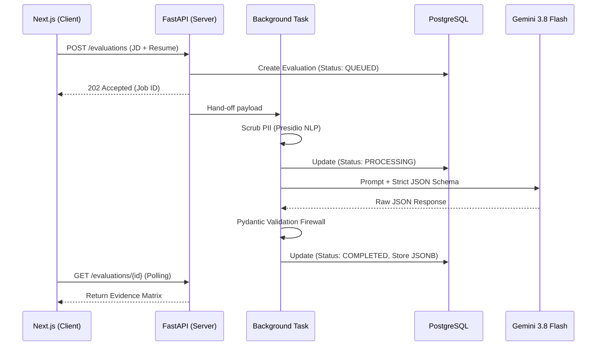

# ⬛ AlignMatrix

[](https://github.com/syedmoazam02/AlignMatrix/actions)
[](https://www.python.org/downloads/)
[](https://www.typescriptlang.org/)
[](https://nextjs.org/)
[](https://fastapi.tiangolo.com)
[](https://opensource.org/licenses/MIT)

**AlignMatrix** is an enterprise-grade, asynchronous document evaluation platform. It replaces opaque "AI Resume Scores" with deterministic, evidence-backed mapping. By enforcing strict JSON contracts and local PII scrubbing, AlignMatrix acts as a zero-trust boundary between sensitive user data and Large Language Models.

---

## 🚀 Why AlignMatrix? (The Engineering Philosophy)

Most AI wrappers blindly trust LLM outputs and leak sensitive user data. AlignMatrix was built to solve the realities of enterprise talent acquisition:

* **🛡️ Privacy-First Pipeline:** Candidate resumes are scrubbed of Personally Identifiable Information (PII) using **Microsoft Presidio** (spaCy NLP) *before* data ever leaves the server.
* **🧱 Zero-Trust AI Contracts:** LLM outputs are treated as untrusted input. We use **Pydantic v2** as a strict firewall. If the LLM hallucinates outside our schema, the transaction fails safely.
* **⚡ Asynchronous Architecture:** Document evaluation is heavy. We utilize a non-blocking, event-driven polling architecture (FastAPI `BackgroundTasks`) so the main thread never blocks.
* **📊 Deterministic Evidence Matrix:** Instead of a generic 1-100 score, the engine maps exact quotes from the resume to specific requirements in the Job Description, categorized by `Demonstrated`, `Partial`, `Missing`, or `Unsupported`.

---

## 🏗️ System Architecture



---

## 🛠️ Quick Start (One-Command Setup)

AlignMatrix is built for rapid deployment and developer experience (DX). You can spin up the entire multi-tier stack locally using Docker.

### Prerequisites
- Docker & Docker Compose
- Google Gemini API Key (or run in deterministic Mock mode)

### Run Locally

```bash
# 1. Clone the repository
git clone https://github.com/syedmoazam02/AlignMatrix.git
cd AlignMatrix

# 2. Configure Environment
cp .env.example .env
# Edit .env and add your GEMINI_API_KEY

# 3. Boot the Stack
docker-compose up --build
```

- **Frontend (Next.js):** [http://localhost:3000](http://localhost:3000)
- **Backend API (FastAPI):** [http://localhost:8000](http://localhost:8000)
- **API Docs (Swagger UI):** [http://localhost:8000/docs](http://localhost:8000/docs)

---

## 🗄️ Tech Stack Highlights

| Domain | Technology | Purpose |
| :--- | :--- | :--- |
| **Frontend** | Next.js 14 (App Router), TypeScript, Tailwind, shadcn/ui | React Server Components, Type-Safe Client, Polling |
| **Backend** | Python 3.10+, FastAPI | High-throughput async HTTP routing |
| **Database** | PostgreSQL 15+, SQLAlchemy, Alembic | Relational indexing + JSONB for dynamic AI payloads |
| **Security** | Microsoft Presidio, spaCy | NLP-based PII identification and redaction |
| **AI Engine** | Google Gemini 3.8 Flash SDK | Massive context window, structured JSON adherence |

---

## 🤝 Contributing (Open Source)

AlignMatrix is actively seeking open-source contributors! Whether you are a senior engineer wanting to optimize our database indexes, or a junior developer looking for your first PR, you are welcome here.

Check out our [Issues tab](https://github.com/syedmoazam02/AlignMatrix/issues) for tasks labeled `good first issue`.

To get started:
1. Read our [AGENTS.md](AGENTS.md) for our core engineering rules and architecture standards.
2. Fork the repo, create a branch (`feature/your-feature-name`), and open a Pull Request.
3. Ensure the test suite passes locally before pushing:

```bash
# Run the 22+ unit and integration tests
pytest -v
```

---

Architected and maintained by Syed Moazam.
